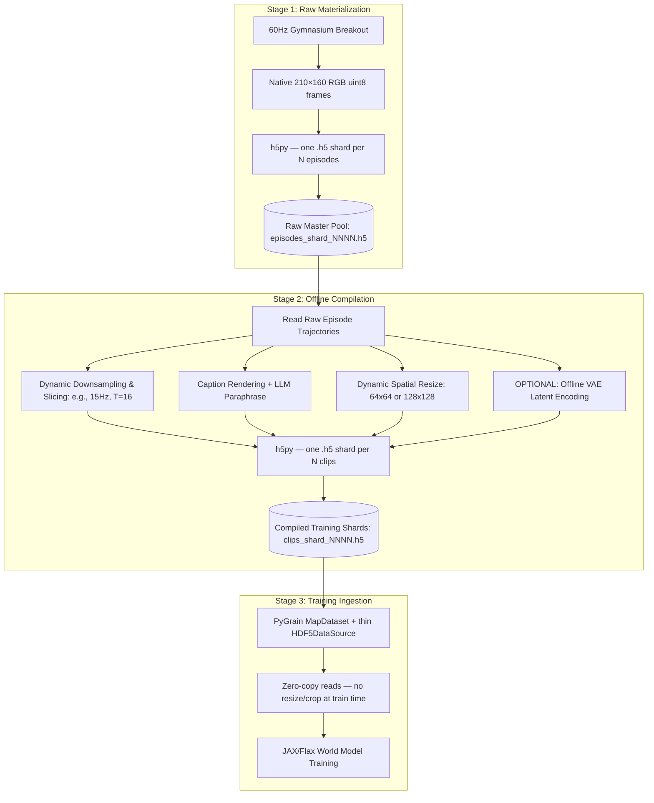

# Dataset Specification: Two-Stage Materialize & Compile Pipeline

This document details the engineering specifications, two-stage data serialization pipeline, and JAX-native PyGrain dataloading integration used to prepare high-fidelity data for our JAX world model.

---

## 1. The Two-Stage Pipeline Architecture

To achieve the ultimate balance between **modeling flexibility** and **extreme training throughput (zero-CPU bottlenecking)**, we implement a decoupled, two-stage dataset preparation pipeline:



By decoupling raw simulation from model configurations, we keep a single, massive physical pool of episodes on disk, but compile highly optimized, model-coupled shards containing **pre-resized frames, pre-rendered captions, and pre-cached VAE latents**, eliminating GPU starvation during training.

---

## 2. Stage 1: Raw Master Pool Specifications (`generate_raw.py`)

We generate a **High-Capacity Raw Episodic Pool** containing complete, continuous, unbroken gameplay trajectories at the emulator's native 60Hz physics frequency:

- **Total Scale:** 1,000 complete gameplay episodes (averaging ~1,500 steps per episode, totaling ~1.5 million frames).
- **Native Resolution:** Frames are stored at the emulator's native $210 \times 160$ RGB resolution with no spatial cropping. Patchification in the VAE encoder handles non-square inputs natively; any region masking or focus cropping can be deferred to Stage 2 compilation.
- **Storage:** Sharded into `.h5` files via `h5py`, with multiple episodes per shard (exact shard size TBD — verify empirically on a sample batch before committing to a storage budget).
- **Episode Definition:** A single episode is a complete game run across all 3 lives, starting from the first ball launch and ending at game over. In-game level resets (all bricks cleared mid-episode) are treated as continuations within the same record for now; see §5 for the open question on how to handle this boundary.
- **Game Mode and Difficulty:** Each episode records the ALE `mode` and `difficulty` switches under which it was generated, as per-episode HDF5 attrs. Breakout exposes 12 modes (`[0, 4, 8, ..., 44]`) and 2 difficulties (`[0, 1]`); see §2E for how we sweep over a curated subset of Breakout variants (skipping the three "Catch" modes 12/28/44, which are a different game).
- **Per-combo Layout:** A multi-mode run organizes shards under `data/raw/mode_MM_diff_D/episodes_shard_NNNN.h5`. The viz loader's `find_shards()` walks this recursively, so the rest of the pipeline can either treat the whole tree as one dataset or filter by sub-directory.
- **Episode Record Format:** Each episode is stored as an HDF5 group `episode_NNNNNN/` within a shard file, with the following structure:

```
episodes_shard_0000.h5
└── episode_000001/
    ├── attrs:  length (int32), mode (int32), difficulty (int32), seed (int64)
    ├── frames          — (L, 210, 160, 3) uint8, LZ4-compressed
    ├── actions         — (L,) int32  (action indices; see §2B)
    └── states/
        ├── paddle_x          — (L,) float32
        ├── ball_x            — (L,) float32
        ├── ball_y            — (L,) float32
        ├── score             — (L,) int32
        ├── bricks_remaining  — (L,) int32
        └── lives             — (L,) int32
```

`frames` is stored LZ4-compressed (Breakout frames compress ~3–4× losslessly). State arrays are stored uncompressed — they are tiny relative to frames. HDF5 variable-length string datasets (`h5py.string_dtype()`) are used for captions in Stage 2 shards.

### A. Epsilon-Greedy Recording Logic

To prevent out-of-distribution (OOD) visual collapse when a human interactively plays the world model and misses the ball, the generation controller uses a mixed-competency heuristic. At the start of each life, the controller sends `FIRE` before engaging the tracking loop.

- **Competent Tracking (80%):** Matches the paddle's $X$ center to the ball's $X$ center, driving long, deep game runs.
- **Exploratory Jitter (15%):** Random commands drawn uniformly from $\{\text{LEFT}, \text{RIGHT}, \text{NOOP}\}$ to generate near-misses, recovery angles, and paddle jitter.
- **Deliberate Misses (5%):** When the ball is in the lower half of the frame ($\text{ball\_y} > 105$ in the 210 px-tall native frame), the controller moves the paddle *away* from the ball, guaranteeing the dataset logs complete death and life-reset sequences.

### B. Action Space

Breakout uses the ALE minimal action set (4 discrete actions). The environment is constructed with `full_action_space=False` (the default in `gymnasium`):

| Index | Name  | Effect                      |
|-------|-------|-----------------------------|
| 0     | NOOP  | No operation; hold position |
| 1     | FIRE  | Launch ball at life start   |
| 2     | RIGHT | Move paddle right           |
| 3     | LEFT  | Move paddle left            |

`FIRE` acts as `NOOP` during active play. The recording controller sends it explicitly at life-start before engaging the tracking loop (§2A).

### E. Game Modes and Difficulty

Atari 2600 Breakout exposes 12 game variations via ALE's `mode` switch (indexed `[0, 4, 8, ..., 44]`) and 2 settings via the `difficulty` switch (`0` = easy, `1` = hard / half-width paddle). These are passed to `gym.make()` and take effect on the next `reset()`.

A snapshot at start-of-play groups the 12 modes as follows:

- **Breakout variants** (full brick wall at start) — `[0, 4, 8, 16, 20, 24, 32, 36, 40]`. Visual layout at start is nearly identical across these; the variants differ in mid-game rules (cavity balls, progressive descent, etc.).
- **Catch variants** (empty play area, no bricks) — `[12, 28, 44]`. Different game mechanics; the paddle catches and re-throws the ball. **Excluded from the default sweep.**

The matrix generator (`datagen/generate_matrix.py`) sweeps over a curated set of Breakout variants by default — `modes=[0, 8, 20, 40]` × `difficulties=[0, 1]` = 8 combinations — writing each to its own `mode_MM_diff_D/` sub-directory. Mode/difficulty are stamped as per-episode HDF5 attrs so episodes from different combos can be safely concatenated downstream.

### C. Caption Generation

Captions are rendered from RAM state at the start frame $t_0$ of each clip and stored alongside the clip at Stage 2 compilation. Each caption encodes four components:

1. **Paddle zone:** $x_p$ binned into three zones — `left` ($x_p < 55$), `center` ($55 \le x_p \le 105$), `right` ($x_p > 105$) — relative to the 160 px-wide play area.
2. **Ball quadrant:** mapped onto a 3×2 grid of the 210×160 frame (3 horizontal × 2 vertical zones), e.g., `upper-left`, `lower-center`.
3. **Ball direction:** derived from the sign of $(dx, dy)$ between frames $t_0$ and $t_0 + 1$, yielding one of four labels: `up-left`, `up-right`, `down-left`, `down-right`.
4. **Game state:** bricks remaining and current score.

Template:

```text
"Atari Breakout: paddle at {paddle_zone}, ball in {ball_quadrant} moving {direction}, {bricks} bricks remaining, score {score}."
```

A mandatory **LLM paraphrasing pass** generates $N \ge 5$ surface variants per rendered template to prevent text conditioning from degenerating into a lookup table (see plan.md §A1). Paraphrases are generated offline and stored with the clip record at Stage 2 compilation.

### D. Dataset Split & Clip Sampling

**Episode-level split:** Splits are assigned at the episode level — no episode appears in two splits — using a fixed-seed shuffle of the 1,000 episode IDs:

| Split | Episodes | Purpose                                           |
|-------|----------|---------------------------------------------------|
| Train | 800      | Model training                                    |
| Val   | 100      | Hyperparameter tuning, early stopping             |
| Test  | 100      | Final evaluation; held out for A4 controllability |

**Clip sampling:** Stage 2 slices each compiled trajectory (at temporal stride $k$) into $T$-frame windows using a sliding window with hop $H$:

$$\text{clips per episode} = \left\lfloor \frac{\lfloor L / k \rfloor - T}{H} \right\rfloor + 1$$

- **Default hop:** $H = T / 2$ (50% overlap), giving approximately $2\times$ the clips of a non-overlapping partition while retaining temporal diversity.
- Clips that would extend past the episode boundary are discarded — no zero-padding.
- Clips spanning a life-transition (ball reset after a miss) are **valid** — the model must see death and reset sequences; these are deliberately represented in the dataset via the 5% deliberate-miss policy (§2A).
- Clips spanning a brick-clear level reset are **excluded** during Stage 2 compilation — see §5 for rationale.

---

## 3. Stage 2: Pre-processing and latents materialization

The offline compiler script reads the Raw Master Pool and writes out highly optimized, model-coupled training shards.

### A. Dynamic Parameters Configured at Compilation

- **Target Resolution:** Downsample the native $210\times 160$ raw frames to a target square resolution: $64\times 64$ (Theme A standard) or $128\times 128$ (High-res stretch).

- **Target Temporal Stride ($k$):** Set the framerate by stepping the raw 60Hz indices by step size $k$ (e.g., $k=4$ for 15Hz, $k=12$ for 5Hz).
- **Sequence Window Length ($T$):** Slice the trajectories into windows of $T$ frames (e.g., $T=16$ or $T=25$).
- **Dynamic Captions:** Read the coordinate dictionaries at the start frame $t_0$ and render the text prompt dynamically from the template engine.
- **VAE Latent Caching (Optional - Highly Recommended):** If the VAE is trained and frozen (Stage A2), passing the frames through the VAE encoder *offline* and storing the latents `(16, 8, 8, C)` on disk reduces training compute by up to **50–70%**.

### B. Compiled Shard Format

Each compiled shard is an HDF5 file containing a flat array of fixed-size clip groups:

```
clips_shard_0000.h5
└── clip_000001/
    ├── attrs:  episode_id, start_frame, stride_k
    ├── frames          — (T, H, W, 3) uint8, LZ4-compressed  (e.g. T=16, H=W=64)
    ├── actions         — (T,) int32
    ├── caption         — scalar UTF-8 string (rendered template)
    ├── captions_para   — (N,) variable-length UTF-8 strings  (LLM paraphrases, N≥5)
    └── states/
        ├── paddle_x          — (T,) float32
        ├── ball_x            — (T,) float32
        ├── ball_y            — (T,) float32
        ├── score             — (T,) int32
        ├── bricks_remaining  — (T,) int32
        └── lives             — (T,) int32
    [optional, post-A2]
    └── latents         — (T, h, w, C) float32  (cached VAE latents)
```

All clips within a shard are fixed-size (same $T$, $H$, $W$), enabling zero-copy reads at training time. The PyGrain `MapDataset` wraps a thin `HDF5DataSource` that maps a global clip index to `(shard_id, clip_group_name)` via a pre-built index JSON.

---

## 4. Sizing & Scaling Laws Analysis

The dataset compilation configurations are aligned directly with the active model capabilities and parameter scales:

| Model Configuration                | Target Parameter Scale | Compiled Stride ($k$) | Horizon Span | Sequence Length ($T$) | Active Samples (Clips) | Targeted Epochs |
| ------------------------------------| ------------------------| -----------------------| --------------| -----------------------| ------------------------| -----------------|
| **VAE / Stage A1 Smoke-Test**      | ~5M–10M params         | **5Hz** ($k=12$)      | 5.0s         | $T=25$                | ~24,000                | 10 epochs       |
| **Theme A Primary Target (A2-A4)** | ~50M–80M params        | **15Hz** ($k=4$)      | 1.07s        | $T=16$                | ~120,000               | 20 epochs       |
| **Theme B Scale Stretch**          | ~150M+ params          | **60Hz** ($k=1$)      | 0.27s        | $T=16$                | ~480,000               | 15 epochs       |

---

## 5. Open Questions & Unknowns

### RAM Address Verification

The state extraction logic reads `paddle_x`, `ball_x`, `ball_y`, `score`, `bricks_remaining`, and `lives` from specific ALE RAM addresses. Commonly cited addresses for Breakout are RAM[72] (paddle x), RAM[99] (ball x), RAM[101] (ball y), but these can differ across ROM versions and `gymnasium`/`ale-py` releases. The addresses must be confirmed empirically against the exact pinned ROM and library version before running at scale. Sanity check: print the indexed RAM bytes while issuing LEFT/RIGHT commands and confirm the values change as expected.

### Brick-Clear Level Reset

When all bricks are destroyed mid-episode, Breakout resets the brick layout and repositions the ball without ending the game. This produces a visually discontinuous transition — `bricks_remaining` jumps from 0 back to a full count — that is atypical of normal gameplay dynamics. Three options:

1. **Treat as continuation (current default):** The reset is part of the trajectory; the model sees it as an unusual event.
2. **Truncate at reset:** End the episode record at the clear and begin a new one.
3. **Filter clips at the boundary:** During Stage 2, detect the reset event (e.g., `bricks_remaining` jumping from 0) and discard any clip that straddles it.

Option 3 is the likely best default — it preserves episode continuity while preventing the temporal incoherence of the reset from appearing in training clips. To be decided before running Stage 2.
