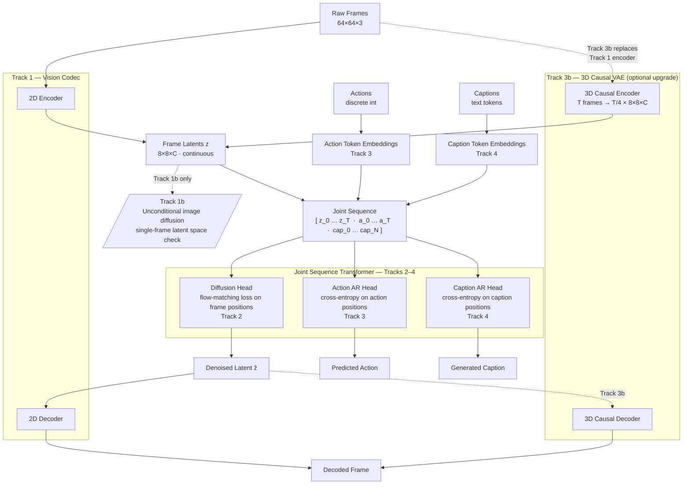

# Plan: Text + Action-Conditioned Video World Model in JAX (v3)

## Introduction

Build a small `world model` from scratch. The term world model can mean many things. We target a video, action, text model where we can model the following tasks such as (but not limited to):

- text -> image / video (text-conditioned generation)
- image/video -> text (classification / captioning)
- text + actions -> image / video (text and action conditioned generation)

For this project, we focus purely on synthetic 2D-physics domain where *every* component is built and trained by us without any black boxes.

## Objectives

- **Primary — learning.** Implement and understand every loss, tokenizer, and conditioning mechanism.
- **Secondary — a working artifact.** A complete action-conditioned world model in the synthetic domain.

## Dataset Selection

### Considerations

The dataset/task is chosen with the following objectives:

1. **Low modeling complexity:** easy to model without a large compute budget (e.g.: deterministic environments, low visual complexity, discrete action space, immediate action-state feedback, etc.)
2. **Data collection ease:** easy to generate a large dataset with required modalities (image, action, text, ground-truth world state) in reasonable time/resources (e.g.: reasonable generation throughput on CPU, controllable scenario generation, etc.)
3. **Non-trivial dynamics:** data should have enough complexity to demonstrate some non-trivial behavior of the world model (e.g.: non-linear dynamics, multi-agent interactions, long-term state persistence, etc.)

### Options considered

1. **Custom 2D Physics Shapes (Bouncing Circles/Squares):**
   - *Pros:* Complete control over ground-truth coordinates, simple rendering.
   - *Cons:* High development time sink. Visuals can feel too trivial.
2. **Gymnasium Atari (e.g., Breakout, Pong) [RECOMMENDED]:**
   - *Pros:* **Zero-code simulation overhead** (`pip install gymnasium`). Captures rich mechanics (ball collisions, brick destruction, UI scores). Directly matches the NeurIPS-grade **DIAMOND** world-model benchmark. Looks incredibly impressive as a final playable world model.
   - *Cons:* Captions must be procedurally generated from RAM/game-state variables (though simple).
3. **Controlled Moving MNIST:**
   - *Pros:* Excellent middle ground. Lightweight, pure Python, download via PyTorch/JAX. Physics are simple (2D particle force vectors applied per-timestep). Perfect for learning stroke/curve representations.
   - *Cons:* Lacks color diversity and advanced game state dynamics.
4. **Crafter (2D Minecraft-like Gridworld):**
   - *Pros:* Highly complex rules (inventory, health, crafting, day/night cycles).
   - *Cons:* Tile textures are complex for a toy 2D VAE; requires slightly more setup.
5. **OpenAI Procgen (e.g., CoinRun, FruitBot):**
   - *Pros:* Procedurally generated levels, excellent for testing visual generalization to unseen backgrounds/layouts. High-contrast, clean 2D graphics.
   - *Cons:* High visual variety makes VAE reconstruction significantly harder for small models. RAM states are not standardized, making state variable/coordinate extraction difficult.
6. **VizDoom (First-Person 3D Action):**
   - *Pros:* Zero-code simulator setup; highly impressive first-person 3D action rollouts.
   - *Cons:* 3D first-person projection introduces partial observability, dynamic scale changes, and high-frequency visual shifts during camera rotation. Highly likely to exceed the capacity of a ~50M parameter model on a small budget.

**Note on Real-Video Datasets (e.g., YouTube, Robotics):**
We explicitly decided against using real-video-based datasets (such as robotics manipulation logs or curated YouTube clips). Real video has infinite visual entropy (reflections, shadows, moving backgrounds, camera motion) that would require a massive, pre-trained black-box VAE to compress cleanly, violating our "built from scratch" objective. Furthermore, real videos do not come with action labels; estimating actions would require training or running a complex Inverse Dynamics Model (IDM), introducing severe engineering overhead and noise that would distract from the core flow-matching and temporal attention mechanics.

### Decision

We choose **Gymnasium Atari (Breakout)** as the primary target. Atari gives us the most interesting physics and game state transitions while requiring zero custom simulator code.

### Dataset Generation & Specifications

To train our action-conditioned world model, we generate a high-quality local dataset from **Gymnasium Atari (Breakout)** using a custom mixed-competency exploration script.

For a full specification of the emulator configuration, state RAM extraction, visual preprocessing pipelines, and linguistic templates, see the separate [dataset.md](dataset.md).

#### Core Dataset Pool Requirements

- **Total Scale (Stage 1 Master Pool):** 1,000 complete gameplay episodes (approx. 1.5 million frames total) stored as continuous raw trajectories.

- **Storage Crop:** $160\times 160$ RGB cropped play area (preserves square aspect ratio, discards scoreboards and borders).
- **Two-Stage Compiler Pipeline:** Downstream parameters—including target image resolution ($64\times 64$ or $128\times 128$), sequence horizon length ($T=16$ or $T=25$), temporal downsampling rates (e.g. 5Hz, 10Hz, 15Hz), caption rendering, and **offline VAE latent caching**—are compiled offline into highly optimized, model-coupled training shards.
- **Exploration Strategy:** A custom $\epsilon$-greedy agent ($80\%$ competent tracking, $15\%$ random jitter, $5\%$ deliberate misses) to prevent Out-of-Distribution failures during interactive rollout.

#### Saved Episode Record Format (Stage 1 Master)

The raw dataset is stored in sharded **HDF5** files (`h5py`), one episode per group. Each group contains: `frames` `(L, 210, 160, 3)` uint8 LZ4-compressed, `actions` `(L,)` int32, and a `states/` subgroup of parallel float32/int32 arrays (`paddle_x`, `ball_x`, `ball_y`, `score`, `bricks_remaining`, `lives`). Compiled Stage 2 shards extend this with a `caption` string dataset and optional `latents`. See [dataset.md](dataset.md) for the full schema.

### Selecting the Vision Encoder Dataset

The raw pool contains 1,000 episodes across 8 (mode, difficulty) combinations. The VAE only needs **single frames**, not sequences, so Stage 2 clip compilation is not required — you can sample frames directly from the Stage 1 HDF5 shards.

#### The Diversity Problem

Breakout frames cluster heavily around two states:

1. **Early game** (full brick wall, ball near paddle): dominant in every episode's opening.
2. **Mid/late game** (partial/empty wall, ball anywhere): much rarer per episode.

A naive random frame sample skews massively toward the full-brick configuration. The VAE would then overfit to that appearance and struggle with late-game visual states (the ones with interesting dynamics).

#### Stratification Strategy

Sample frames along **four independent axes**, drawing roughly equal counts from each stratum:

**Axis 1 — Game mode × difficulty (8 combos)**
Equal samples from `mode_00_diff_0`, `mode_00_diff_1`, ..., `mode_40_diff_1`. This covers the visual variation in brick layout patterns introduced by different game modes.

**Axis 2 — Bricks remaining (4 buckets)**
Direct measure of how far into the game a frame comes.

| Bucket | Bricks remaining | Interpretation |
|---|---|---|
| 0 | 108 (full wall) | Game start |
| 1 | 55–107 | Early-mid |
| 2 | 10–54 | Mid-late |
| 3 | 0–9 | Endgame / brick-clear |

Uniform sampling across these buckets forces the VAE to see all visual states equally. Since `bricks_remaining` is stored in Stage 1 HDF5 state arrays, this is free to implement.

**Axis 3 — Paddle zone (3 buckets: left / center / right)**
Ensures the VAE sees the paddle at all horizontal positions, preventing the decoder from hallucinating it into a learned prior position.

**Axis 4 — Ball position zone (6 buckets: 3 horizontal × 2 vertical)**
The ball is the hardest object to reconstruct (small, fast, high-contrast). Equal coverage across ball positions ensures the decoder learns to place it accurately everywhere.

#### Sampling Recipe

Pseudo-algorithm for building the VAE training frame set:

```text
target_per_stratum = total_frames / (8 modes × 4 brick_buckets)
                   = 100k / 32  ≈ 3,125 frames per (mode, brick_bucket)

for each (mode, difficulty) combo:
    load all episodes in that combo
    bin frames by bricks_remaining into 4 buckets
    from each bucket: sample min(available, target_per_stratum) frames
    apply secondary soft-weighting by paddle zone to equalize within bucket
```

A secondary pass checks that each of the 6 ball zones contains at least `min_ball_zone_count` frames, re-sampling if any zone is underrepresented. The ball-in-corner frames are rare in natural play but critical for reconstruction quality.

#### Frame Count Recommendation

| Use | Frames | Notes |
|---|---|---|
| VAE train | ~80k | Stratified as above |
| VAE val | ~10k | Stratified same way, different episodes |
| VAE test | ~10k | Episode-disjoint from train+val |

Total: ~100k frames. This is a tiny dataset for a VAE — the model will see each frame many times. High diversity per frame is therefore critical. With 1,000 episodes × ~1,500 frames each = 1.5M total frames, 100k is only 6.7% of the pool, so the stratification headroom is large.

#### Handling Life-Reset Frames

Frames immediately following a ball reset (life lost) look unusual: paddle is centered, ball spawns at a fixed position, no ball motion yet. Include these deliberately — the VAE must handle them, and they occur during world model rollouts in Track 4.

Frames immediately following a brick-clear level reset are also unusual (bricks teleport back). Include a small fixed count (~2k) to prevent out-of-distribution failure, but do not oversample.

---

## Implementation Tracks

Each track isolates one new mechanism. Models are deliberately small — the domain is simple and a larger model just memorizes. Tracks 2–4 build a single joint-sequence transformer where image latents use diffusion loss and discrete tokens (actions, text) use AR cross-entropy loss (Transfusion-style). This enables any-conditional inference (`P(X | Y)` for any modality subset) without per-modality conditioning mechanisms.

| Track | What it builds | Loss(es) | New mechanism | Example conditionals unlocked |
|---|---|---|---|---|
| **1** | 2D KL-VAE: `image ↔ latent` | Reconstruction + KL + perceptual | Reparameterization, latent compression | — (codec only) |
| **1b** | Unconditional image generation in latent space | Diffusion (flow matching) | Latent diffusion, Euler sampler | `∅ → frame` |
| **2** | Video diffusion model in latent space | Diffusion | Temporal attention over image latent sequence | `frames → next frame` |
| **3** | Hybrid video + action model | Diffusion (frames) + AR cross-entropy (actions) | Joint sequence, dual loss, action token AR head | `frames → actions`, `frames + actions → next frame` |
| **3b** *(optional, post e2e spike)* | 3D causal VAE: inflate 2D VAE weights into temporal codec | Reconstruction + KL + perceptual (per-clip) | 3D causal convolutions, temporal compression, weight inflation | — (codec upgrade; re-enables all Track 2–3 conditionals with 4× fewer temporal tokens) |
| **4** | Full any-conditional world model | Diffusion (frames) + AR cross-entropy (actions + text) | Text token AR head, modality-masked training | `text + actions → frames`, `frames → text`, all prior |

**Training coverage note (Track 3+):** batches must explicitly sample all conditioning patterns — not just forward dynamics. If training only covers `(frames, actions) → next frame`, the model will be poor at `frames → actions`.

**Track 3b note:** only worth attempting once the end-to-end diffusion+AR spike (Tracks 2–3) is validated. The 3D VAE replaces the per-frame encoder with a clip-level encoder (e.g. 4× temporal compression: 16 frames → 4 temporal latent positions × 8×8 spatial = 256 tokens vs 1024). The downstream transformer is re-used unchanged — only the image latents change shape. Initialize 3D conv weights from the 2D VAE using the AnimateDiff inflation recipe [20].

### Component diagram

How the components introduced across tracks connect at inference time. Solid edges are the main data path; dashed edges are the Track 3b upgrade path.



## Evaluation philosophy

The synthetic domain's killer feature is ground-truth state. Primary metrics are physics-grounded — object-position MSE, collision-timing error, action-response accuracy — computed by detecting shapes in samples and comparing to ground truth. FID (Heusel et al., 2017) and FVD (Unterthiner et al., 2019) are reported only as rough secondary proxies; their feature extractors (Inception, I3D) are out-of-distribution on synthetic shapes and noisy even on real video.

## Prior work

Organized bottom-up: **Foundations** first (the generative-modeling and architecture building blocks we implement from scratch), then the applied-system categories (world models, video DiTs, joint-sequence / any-conditional models), then the **world-model lineage** our framing descends from. Each row summarizes a work along three axes — its **main task**, **high-level architecture/idea**, and **key contribution** — plus why it matters for us. Works whose *overall goal* is closest to ours (a single any-conditional, hybrid AR+diffusion world model) get a detailed side-by-side comparison in [§ Detailed comparisons](#detailed-comparisons-vs-our-proposal).

### Foundations

The building blocks the plan tells you to implement by hand. These are *method* references — not systems to compare our overall design against.

#### Generative modeling: objectives, samplers & paradigms

| Paper | Main task | High-level idea | Key contribution | Relevance to us |
|---|---|---|---|---|
| **DDPM** (Ho et al., 2020) | noise → image | discrete-time Gaussian diffusion, U-Net **ε-prediction** | made diffusion competitive with GANs via a simple denoising objective | the baseline diffusion objective; the mental model flow matching generalizes |
| **Score-SDE** (Song et al., 2021) | noise → data | continuous-time forward/reverse **SDE**, score matching, probability-flow **ODE** | unified diffusion as score-based SDEs; deterministic ODE sampling | the ODE-sampling view underpinning our Euler sampler |
| **EDM** (Karras et al., 2022) | noise → image | reparameterized diffusion: preconditioning + noise schedule design | a clean "design space" — scalings, σ-schedule, sampler choices | practical defaults for stable from-scratch training |
| **Flow Matching** (Lipman et al., 2023) | noise → data | regress an ODE **velocity field** along probability paths | simulation-free training of continuous normalizing flows | **our Track 1b/2 training objective** |
| **Rectified Flow** (Liu et al., 2023) | noise → data | learn straight transport paths, optional reflow | straightened paths enable few-step sampling | the flavor of flow matching we'd use; fast sampling |
| **Stochastic Interpolants** (Albergo & Vanden-Eijnden, 2023) | noise → data | unifying interpolant framework spanning diffusion ↔ flows | general theory tying diffusion and flow matching together | conceptual glue for understanding the objective family |
| **Classifier-Free Guidance** (Ho & Salimans, 2022) | conditional generation | jointly train conditional + unconditional, extrapolate at sampling | guidance without a separate classifier; a quality/diversity knob | used in our sampler and in Genie 2 |
| **MAR** (Li et al., 2024) | image generation | **autoregressive over continuous tokens** with a small per-token **diffusion-loss** head | AR image generation *without* vector quantization | continuous-token AR — the **direct alternative to Transfusion** for putting frame latents in a sequence (see [Transfusion vs us](#transfusion-vs-us)) |
| **GIVT** (Tschannen et al., 2024) | image generation | AR transformer emitting continuous vectors via **Gaussian-mixture** heads | quantization-free, "infinite-vocabulary" AR over real-valued tokens | a second continuous-token-AR option to weigh against discrete tokens |

#### Architecture backbones & tokenizers

| Paper | Main task | High-level architecture | Key contribution | Relevance to us |
|---|---|---|---|---|
| **DiT** (Peebles & Xie, 2023) | latent → image | **transformer** diffusion backbone with **AdaLN-zero** conditioning | transformers scale for diffusion; AdaLN-zero conditioning block | **the backbone for every track** |
| **Latent Diffusion / Stable Diffusion** (Rombach et al., 2022) | text → image | diffusion in a **pretrained VAE latent space** + cross-attention | moving diffusion to latent space for efficiency | **Track 1b blueprint**: diffuse in our own VAE latents |
| **VAE** (Kingma & Welling, 2014) | image ↔ latent | encoder/decoder, **reparameterization**, ELBO/KL objective | the latent-variable model + reparameterization trick | **Track 1 KL-VAE core** |
| **VQ-VAE** (van den Oord et al., 2017) | image ↔ discrete codes | encoder + **codebook** quantization | discrete latent codes for downstream generative models | the discrete-tokenizer alternative we weigh against the KL-VAE |
| **VQGAN** (Esser et al., 2021) | image ↔ codes | VQ-VAE + adversarial + **perceptual** loss ("Taming Transformers") | sharp, high-compression tokenizers feeding transformers | the perceptual-loss recipe informing Track 1 |
| **LPIPS** (Zhang et al., 2018) | perceptual distance | distance in features of a pretrained net | learned perceptual similarity ≈ human judgment | **the perceptual-loss term in Track 1** (note: uses a pretrained net — a small dependency on our "from scratch" rule) |
| **MAGVIT-v2** (Yu et al., 2024) | video ↔ tokens | **lookup-free quantization** video tokenizer | SOTA discrete video tokens; "tokenizer is key" | reference if a VQ video route is weighed against the 3D KL-VAE (Track 3b) |

### Action-conditioned world models

| Paper | Main task | High-level architecture | Key contribution | Relevance to us |
|---|---|---|---|---|
| **GameGAN** (Kim et al., NVIDIA, 2020) | actions + past frames → next frame (Pac-Man, VizDoom) | **GAN**: LSTM dynamics engine + external memory module + CNN rendering engine, adversarial + cycle losses | first neural game engine — emulates a game purely from frames+actions with no access to the real engine | the field's *adversarial* great-grandfather; the one non-diffusion/non-AR generative route, implicitly ruled out when we pick flow matching |
| **DIAMOND** (Alonso et al., NeurIPS 2024) | actions + past frames → next frame (RL world model) | pixel-space EDM diffusion U-Net, autoregressive over frames | diffusion world models preserve fine visual detail that matters for RL; agents trained *inside* the model | ~50M params, Atari, action-conditioned — our **closest benchmark analogue** |
| **GameNGen** (Valevski et al., 2024) | actions → next frame (real-time Doom) | Stable-Diffusion latent U-Net, fine-tuned, AR rollout with noise augmentation | real-time (~20fps) playable neural game engine; noise augmentation curbs AR drift | validates fast AR rollout + drift mitigation |
| **Oasis** (Decart/Etched, 2024) | actions → next frame (Minecraft) | latent-diffusion DiT + spatial autoencoder, **diffusion forcing** (per-token noise levels) | open real-time diffusion world model; diffusion forcing for long stable rollouts | temporal coherence technique for Track 2+ |
| **Lucid** (2025) | actions → next frame (Minecraft) | latent-diffusion DiT, inference-optimized | open Minecraft world model at ~20fps — a faster, leaner Oasis-style engine | mostly a real-time engineering point on the Oasis design; low structural novelty for us |
| **Genie** (Bruce et al., 2024) | unlabeled video → playable environment | ST-transformer: VQ video tokenizer + **latent action model** + MaskGIT dynamics | learns a *latent action space* from video with no action labels | we have ground-truth actions, so the latent-action trick is less central, but the joint video+action modeling is relevant |
| **Genie 2** (DeepMind, 2024) | single image prompt + actions → playable 3D world (future frames) | **autoregressive latent diffusion**: frozen autoencoder → large transformer dynamics model, classifier-free guidance for action control | foundation-scale, action-controllable, long-horizon-consistent playable worlds from one image; **real action inputs** (vs Genie 1's latent actions); emergent physics/memory | action-conditioned latent diffusion at scale; long-horizon memory target; see [detailed comparison](#genie-2-vs-us) |
| **WHAM / Muse** (Kanervisto et al., Microsoft, Nature 2025) | actions + past frames → next frame (+ unconditional gen) for game-dev ideation | **discrete VQ** image tokens + action tokens interleaved in a decoder-only **AR transformer** | interactive world model as pure next-token AR over joint image+action tokens; creative-tool (not RL/playable) framing | **closest games-native analogue to our action-token-in-sequence mechanism** — but fully discrete (VQ frames), where we keep frames continuous (the same divergence as GAIA-1) |
| **The Matrix** (Feng et al., 2024) | limited move-controls → future video (infinite horizon) | latent-diffusion DiT trained on game + real-world footage, streaming/AR rollout | real-time, **infinite-horizon** controllable generation with map-level consistency | another long-rollout reference alongside Diffusion Forcing / Rolling Diffusion; shows continuous-latent diffusion scaling to open-world driving |
| **Cosmos-Predict2** (NVIDIA, 2025) | text/image/video → future video (physical-AI foundation model) | **continuous 3D causal tokenizer** (Cosmos Tokenizer) + diffusion DiT (also an AR variant), very large scale | production-scale physical-world generation; high-compression continuous tokenizer | scale + continuous-tokenizer blueprint; see [detailed comparison](#cosmos-predict2-vs-us) |
| **Diffusion Forcing** (Chen et al., 2024) | sequence generation / planning | per-token **independent noise levels** in a causal sequence model | unifies next-token AR and full-sequence diffusion; stable, variable-length rollouts | the technique behind Oasis; **directly targets our long-rollout risk** (Track 2+) |
| **Rolling Diffusion** (Ruhe et al., 2024) | video generation | sliding window with **per-frame increasing noise** | reframes video diffusion as a rolling, progressive denoising over time | an alternative long-horizon rollout scheme for Track 2+ |

**How this "playable game engine" lineage relates to us.** The rows above (GameGAN → DIAMOND / GameNGen → Oasis / Lucid / The Matrix → WHAM, plus Genie 1/2) are the *games-native* branch of world modeling — the systems catalogued in lists like [awesome-world-model-games](https://github.com/dweam-team/awesome-world-model-games). Two structural facts separate that whole branch from our proposal:

- **They are single-conditional interactive emulators.** Every one models one direction — `(past frames, action) → next frame` — optimized for real-time playable rollout. None supports the reverse or cross-modal conditionals (`frames → actions`, `frames → text`, `text + actions → frames`) that are the point of our any-conditional design. That is why the papers most aligned with our *objective* (Transfusion, UniDiffuser, GAIA-1) sit in the [joint-sequence section](#joint-sequence-and-any-conditional-models), not here.
- **None has a text modality, and each commits to a single generative paradigm** — adversarial (GameGAN), pure diffusion (DIAMOND, GameNGen, Oasis, Lucid, The Matrix, Genie 2), or pure discrete-AR (WHAM, Genie 1). Ours is the only one combining continuous-diffusion frames and discrete-AR tokens in *one* transformer.

They remain valuable on two axes. First, **action-conditioning mechanism**, where this branch is the full menu of alternatives to our "discrete action tokens in the joint sequence" choice: channel-concat (DIAMOND), classifier-free guidance (Genie 2), learned latent actions (Genie 1), and — closest to us — VQ action tokens in an AR stream (**WHAM**), which differs only in quantizing frames where we keep them continuous. Second, **long-horizon rollout stability** (our Track 2+ risk), where The Matrix's infinite-horizon streaming joins Diffusion Forcing, Rolling Diffusion, and GameNGen's noise augmentation as concrete mitigations. A final contrast worth stating: the recorded-gameplay systems (Oasis, Lucid, WHAM, The Matrix) have **no ground-truth world state**, so they fall back to FVD/human evaluation — whereas our Gymnasium sim exposes `ball_x`/`paddle_x`/`bricks_remaining`, enabling the physics-grounded metrics in our [evaluation philosophy](#evaluation-philosophy).

### Video DiT architecture

| Paper | Main task | High-level architecture | Key contribution | Relevance to us |
|---|---|---|---|---|
| **Sana** (NVIDIA, 2024) | text → image (efficient high-res) | **Linear-attention DiT** + 32× deep-compression autoencoder + Mix-FFN, decoder-only text encoder | 4K synthesis cheaply; linear attention makes long token sequences tractable | AdaLN-zero, Mix-FFN, linear attention for long sequences (Track 2 OOM) |
| **CogVideoX** (Yang et al., 2024) | text → video | **3D causal VAE** + expert-transformer DiT with **expert AdaLN**, 3D full attention | 3D causal VAE and expert adaptive-LN for joint text+video modeling | 3D VAE reference for Track 3b; expert AdaLN conditioning |
| **Latte** (Ma et al., 2024) | text/class → video | latent video DiT with **factorized spatial & temporal** transformer blocks | systematic study of factorized spatio-temporal attention; joint image+video training recipe | factorized attention to manage sequence length (Track 2) |
| **AnimateDiff** (Guo et al., ICLR 2024) | text → video (animate a personalized T2I model) | frozen T2I U-Net + inserted **motion module** (temporal attention) trained on video | plug-in motion module; weight **inflation** from 2D → temporal blocks | inflation recipe for Track 3b |

### Joint-sequence and any-conditional models

| Paper | Main task | High-level architecture | Key contribution | Relevance to us |
|---|---|---|---|---|
| **Gato** (Reed et al., DeepMind, 2022) | many tasks (Atari, captioning, robotics) → actions/text | single decoder-only **AR transformer** over a flat, fully-discretized multimodal token sequence | one set of weights + one AR objective across modalities and tasks | most direct *flat joint-sequence* precedent — but **fully discrete** (no diffusion path) |
| **GAIA-1** (Wayve, 2023) | video + text + ego-action → future video (driving) | discrete image tokens (VQ) + AR world-model transformer + **video diffusion decoder** | world model as next-token prediction over a joint video/text/action sequence, with a diffusion decoder for fidelity | structurally our target in another domain; see [detailed comparison](#gaia-1-vs-us) |
| **UniDiffuser** (Bao et al., 2023) | any → any over {image, text} | single diffusion transformer (U-ViT) over concatenated image+text tokens, **per-modality timesteps** | one model captures every distribution — `P(img)`, `P(txt)`, `P(img\|txt)`, `P(txt\|img)`, joint — by varying modality timesteps | the **any-conditional objective** we want; see [detailed comparison](#unidiffuser-vs-us) |
| **VideoPoet** (Yu et al., Google, 2023) | text/image/video/audio → video/audio | decoder-only **AR LLM** over MAGVIT-v2 (video/audio) + text tokens, fully discrete | LLM-style multitask multimodal generation with zero-shot task chaining | full conditional variety we target — but **fully discrete-AR** (frames quantized) |
| **Transfusion** (Zhou et al., Meta, 2024) | text ↔ image (generation + understanding) | **single transformer, two losses**: discrete text via causal next-token AR, continuous image patches via diffusion (bidirectional within the image) | combine AR (discrete) + diffusion (continuous) in one sequence *without quantizing images* | **exactly our loss/architecture recipe**; see [detailed comparison](#transfusion-vs-us) |
| **CoDi** (Tang et al., 2023) | any → any (text/image/audio/video) | **composable** latent diffusion models with aligned latent spaces | any-to-any generation, including simultaneous multi-modality outputs | broader any-conditional precedent than UniDiffuser, but all-diffusion (no AR) |
| **4M** (Mizrahi et al., 2023) | any → any (many tokenized modalities) | single transformer trained by **masked modeling** over tokenized modalities | scalable multimodal masked pretraining → any-conditional generation | the masked-multimodal recipe **closest to our modality-masking** training |
| **Chameleon** (Meta, 2024) | text + image → text + image | **early-fusion**, fully-tokenized mixed-modal AR transformer | one tokenized vocabulary + one AR loss for interleaved mixed-modal docs | the fully-discrete early-fusion counterpoint to our hybrid loss |
| **Unified-IO 2** (Lu et al., 2024) | any → any (image/text/audio/**action**) | single seq2seq transformer over discretized modalities | one model spanning many I/O modalities, explicitly including actions | broadest discrete any-conditional incl. an action modality — but fully discrete |

### World-model lineage (RL / latent imagination)

The conceptual ancestors of the term "world model": latent dynamics models learned for planning/control. Less directly comparable to us (they optimize for control, not high-fidelity generation), but this is where our framing — a learned latent model of an environment — originates.

| Paper | Main task | High-level architecture | Key contribution | Relevance to us |
|---|---|---|---|---|
| **World Models** (Ha & Schmidhuber, 2018) | learn an env model for control | **VAE** (vision) + **MDN-RNN** (memory/dynamics) + small controller | coined "world model"; trains a policy *inside* the learned dream | origin of our framing: latent-space dynamics + dreaming |
| **PlaNet** (Hafner et al., 2019) | latent planning from pixels | **RSSM** latent dynamics (deterministic + stochastic state) | planning directly in a learned latent dynamics model | predecessor latent-dynamics design to Dreamer |
| **Dreamer / DreamerV3** (Hafner et al., 2019–2023) | RL via imagined rollouts | RSSM world model + actor-critic trained in latent imagination | learn behaviors purely in imagination; V3 is a generalist (incl. Atari) | the latent-imagination world model lineage; Atari mastery from a learned model |
| **SimPLe** (Kaiser et al., 2019) | model-based RL on Atari | video-prediction model + PPO in the learned model | sample-efficient Atari from a learned pixel model | model-based RL on **our exact domain** (Atari) |

### Detailed comparisons vs our proposal

Our proposal in one line: **a single transformer over a joint sequence of `[image latents | action tokens | text tokens]`, where continuous image latents carry a diffusion/flow-matching loss and discrete action/text tokens carry an AR cross-entropy loss, trained with modality-masked sampling so one model serves any conditional `P(X | Y)`** — on a from-scratch JAX stack in a synthetic Atari domain.

#### Transfusion vs us

| Axis | Transfusion | Our proposal |
|---|---|---|
| Modalities | text + image | image latents + actions + text |
| Continuous stream | image patches via diffusion | image latents via flow matching (same idea) |
| Discrete stream | text via causal AR | actions + text via causal AR (same idea) |
| Single transformer, dual loss | **yes** | **yes** |
| Domain / scale | web-scale text+image | toy Atari, ~tens of M params, JAX from scratch |
| Conditioning style | sequence position + attention masking | same, plus explicit modality-mask training |

**Verdict:** Transfusion is the mechanism we are copying almost verbatim — hybrid AR+diffusion in one transformer, images kept continuous. The plan's Track 3+ is explicitly "Transfusion-style." The differences are scope (we add a third modality, *actions*, and a temporal/video axis) and intent (learning-from-scratch on a toy domain, not scale). A close cousin worth weighing is **MAR** (see [Foundations](#foundations)): it also keeps frame latents continuous, but generates them *autoregressively* with a per-token diffusion-loss head rather than Transfusion's bidirectional-attention image blocks — that is the main design fork for how our continuous frame tokens enter the sequence.

#### UniDiffuser vs us

| Axis | UniDiffuser | Our proposal |
|---|---|---|
| Goal | one model for **all** conditionals `P(X\|Y)` | same — any-conditional over our modality subsets |
| How "any-conditional" is achieved | per-modality timesteps (a clean timestep = "given", a noised timestep = "generate") | modality masking / which tokens get a diffusion-vs-AR target per batch |
| Text representation | **diffused** (continuous embeddings, noise-predicted) | **discrete AR** (cross-entropy) — differs |
| Loss | single diffusion loss on both modalities | **dual** loss (diffusion for frames, AR for tokens) |
| Modalities | image + text | image latents + actions + text (video; + time axis) |

**Verdict:** UniDiffuser is the source of our *objective* — get every conditional from a single model by varying what's "given" vs "generated" per example. But it diffuses text, whereas we keep discrete modalities on an AR head. So we inherit UniDiffuser's any-conditional philosophy but realize it through Transfusion's dual-loss mechanism rather than UniDiffuser's all-diffusion one.

#### Cosmos-Predict2 vs us

| Axis | Cosmos-Predict2 | Our proposal |
|---|---|---|
| Goal | foundation-scale physical-world video generation | toy, fully-from-scratch world model for learning |
| Tokenizer | continuous **3D causal** VAE, heavily pretrained | our own 2D KL-VAE (Track 1), optional 3D causal in Track 3b |
| Frame generative model | diffusion DiT (continuous) | diffusion/flow matching (continuous) — aligned |
| Discrete AR text/action head | not the central design | **core** to our any-conditional goal |
| Action conditioning | not the primary modality | first-class (Track 3) |
| Scale / compute | enormous | tiny, single-GPU |

**Verdict:** Cosmos shares our *continuous-tokenizer + diffusion* backbone and is a useful blueprint for the 3D VAE (Track 3b) and overall world-model framing, but it is a scale and engineering target, not a structural twin: it isn't built around a single any-conditional transformer with a discrete AR head, and actions/text aren't the organizing principle.

#### GAIA-1 vs us

| Axis | GAIA-1 | Our proposal |
|---|---|---|
| Modalities | video + text + ego-action | video (image latents) + actions + text |
| Joint sequence over all modalities | **yes** | **yes** |
| Frame representation | **discrete VQ tokens** in the AR model | **continuous latents** with diffusion loss |
| High-fidelity frames | separate video **diffusion decoder** | diffusion is in-model on the latents |
| Domain | real driving video | synthetic Atari |

**Verdict:** GAIA-1 is the closest *system-level* analogue — same triplet of modalities (video, text, action) modeled as one joint sequence for a world model. The key divergence is that GAIA-1 quantizes frames into discrete tokens for an AR core and bolts on a diffusion decoder, whereas we keep frames continuous and put the diffusion loss *inside* the single transformer (Transfusion-style), avoiding a separate decoder and VQ quantization.

#### Genie 2 vs us

| Axis | Genie 2 | Our proposal |
|---|---|---|
| Goal | foundation, playable 3D world from a single image prompt | toy any-conditional world model for learning |
| Frame generative model | autoregressive **latent diffusion** (continuous latents) | latent diffusion / flow matching (continuous) — aligned |
| Action conditioning | real action inputs via **classifier-free guidance** | actions as **discrete AR tokens** in the joint sequence |
| Text / any-conditional | image-prompted; no text modality or any-conditional head | text + actions + frames, any-conditional via dual-loss masking |
| Long-horizon consistency | emergent memory (~minute of off-screen recall) | not a target at our scale |
| Domain / scale | large-scale 3D video, very large | synthetic 2D Atari, tiny, JAX from scratch |

**Verdict:** Genie 2 is the most impressive demonstration of our *frame backbone* — action-controllable, continuous-latent diffusion rolled out autoregressively — and validates that approach at scale. But it conditions actions through CFG rather than treating them as tokens in a joint sequence, and it has no text modality or any-conditional objective. Like Cosmos, it is a capability/scale north star, not a structural twin: our distinguishing bet is the single any-conditional transformer with a discrete AR head for actions and text.

### Which work is most closely aligned?

No single paper matches us on every axis, because our proposal is deliberately a **combination**:

- **Mechanism → Transfusion.** The "one transformer, continuous image latents via diffusion + discrete tokens via AR, dual loss on a joint sequence" recipe is taken almost directly from Transfusion. If forced to name *one* most-aligned paper, it is **Transfusion**.
- **Objective → UniDiffuser.** The "single model serves every `P(X|Y)`" goal, achieved by varying which modalities are given vs generated per batch, is UniDiffuser's contribution.
- **System framing → GAIA-1.** The specific triplet (video + text + action) as one joint world-model sequence is GAIA-1's shape, minus its VQ-quantized-frames-plus-diffusion-decoder split.

In short: **our proposal ≈ GAIA-1's modality structure, realized with UniDiffuser's any-conditional objective, through Transfusion's hybrid AR+diffusion mechanism** — on a from-scratch JAX stack in a toy Atari domain. Transfusion is the single closest, with UniDiffuser the closest on objective.

### Reference repositories

| Repo | Used for |
|---|---|
| `willisma/diffuse_nnx` | JAX/NNX diffusion reference |
| `Vchitect/Latte` | Factorized attention implementation |
| `guoyww/AnimateDiff` | Temporal inflation recipe |
| `eloialonso/diamond` | DIAMOND Atari world model |
| `etched-ai/open-oasis` | Open Oasis world model |
| `nvidia-cosmos/cosmos-predict2` | Cosmos scale reference |

## Risks / open questions

- Synthetic domain too simple → memorization. *Mitigation:* held-out action/config splits; physics metrics over FVD; deliberately small models.
- From-scratch VAE artifacts.
- **Hybrid Loss Balancing (Track 3+):** Joint sequences with dual losses (Diffusion and AR) are highly sensitive to gradient imbalances. The scale of the continuous flow-matching loss can easily dominate the discrete AR cross-entropy loss. We will need to implement dynamic loss weighting or separate learning rate schedules for the AR and Diffusion heads to ensure the model learns action conditioning alongside pixel generation.
- **Sequence Length Bottlenecks (Track 2+):** Flattening multi-frame spatial latents (e.g., 16 frames of $20\times 20$ latents) results in sequence lengths that quickly exceed the memory capacity of standard dense self-attention. We must explicitly define whether we are using factorized spatial-temporal attention (e.g., Latte architecture) or full 3D attention to manage OOM errors on small hardware.
- **Latent Space Regularization (Track 1):** The KL penalty must be carefully tuned for downstream diffusion. Over-regularization will blur the sharp edges of Atari sprites, while under-regularization will create a latent distribution that the Track 2 diffusion model struggles to learn.
- **Dataset State-Space Coverage:** Atari Breakout is prone to highly correlated, endless loops (e.g., the ball bouncing horizontally indefinitely). The dataset generation script must include periodic forced resets, random ball respawns, or varied initial brick layouts to prevent the model from memorizing infinite-bounce trajectories.
- **Physics Perception on Noisy Outputs:** Evaluating object-position MSE requires extracting coordinates from generated frames. Because early diffusion outputs will contain flickering edges or slight noise, standard contour detection (e.g., OpenCV) may fail. Evaluation pipelines must either use highly noise-tolerant heuristics or a lightweight CNN trained to extract coordinates from generated frames.
