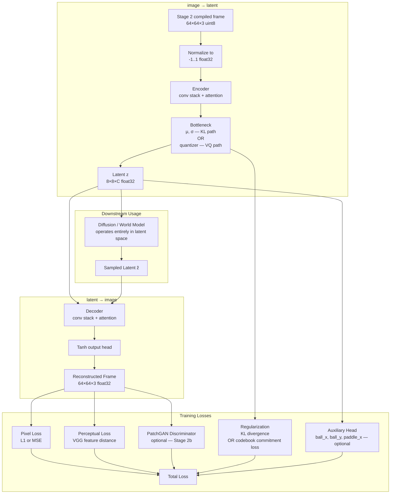
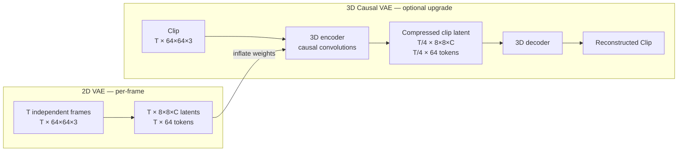
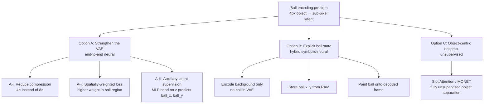
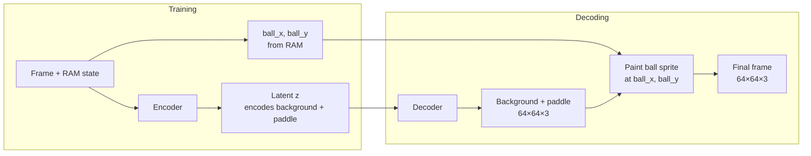

# Vision Codec Design: Bidirectional Image ↔ Latent

This document designs the **vision codec** — the component responsible for compressing raw Breakout frames into a compact latent space and reconstructing frames from that latent space. It is used in both directions: `image → latent` (encoding) and `latent → image` (decoding).

In the project roadmap this is **Track 1**: the VAE is the first thing built, trained in isolation, and frozen. Every downstream track (1b unconditional smoke test, 2 video diffusion, 3 joint action model, 4 full any-conditional) operates entirely in the learned latent space. The codec also has an optional **Track 3b** extension into a 3D causal VAE — but only after the end-to-end diffusion+AR pipeline is validated.

---

## 1. What the Vision Codec Must Do

The codec is the interface between pixel space and latent space for the entire world model. Both directions are first-class:

| Direction | Where it runs | Why it must work well |
|---|---|---|
| **Encode** `image → latent` | Offline (data prep) + online (first frame conditioning in Track 4) | Poor encoding destroys information that diffusion cannot recover |
| **Decode** `latent → image` | Inference (sampling) | The final visual output lives here; artifacts are directly visible |

**Input frame provenance.** The VAE never sees raw Atari frames. Stage 1 stores frames at the native emulator resolution of **210×160** (height × width, uncropped). The Stage 2 compiler — not yet built — will crop these to a square play area (**160×160**, dropping the ~25 px score header and ~25 px black border row) and then resize to the target model resolution. The VAE operates on Stage 2 compiled frames. All spatial dimensions cited in this document (input size, latent size, token counts) assume the **64×64** Stage 2 target; the 128×128 stretch variant scales them proportionally.

> **Stage 2 crop requirement:** a direct bilinear resize from 210×160 → 64×64 would squash the aspect ratio (1.31:1 → 1:1), compressing the ball and paddle vertically. The Stage 2 compiler must crop to 160×160 *before* resizing to preserve geometry.

The latent space must satisfy three constraints:

1. **Compact enough** that the diffusion model can learn its distribution with a small parameter budget (~50M params).
2. **Expressive enough** that ball position, paddle position, and brick layout can be recovered from the latent — these are the ground-truth quantities the physics eval checks.
3. **Token-sequence compatible** — from Track 2 onward, frame latents are flattened into a joint token sequence alongside discrete action and caption tokens (Transfusion-style). The spatial grid size of the latent directly multiplies the transformer sequence length: an 8×8 latent contributes 64 tokens per frame, and a 16-frame clip becomes 1,024 frame tokens before actions and captions are added. The compression ratio is therefore not just a reconstruction quality decision — it is a sequence length budget decision.

---

## 2. System Diagram



### Optional Track 3b: 2D → 3D Extension

This extension is **not required before Track 2 or Track 3**. Tracks 2 and 3 use the per-frame 2D VAE, encoding each frame independently and concatenating the resulting latent tokens into the joint sequence. Track 3b is attempted only after the end-to-end diffusion+AR pipeline (Tracks 2–3) is validated — it then replaces the per-frame encoder with a clip-level encoder, reducing frame tokens by 4×.



The 3D extension inflates 2D spatial convolutions into 3D causal convolutions (first-frame temporal padding so the model can also encode/decode single frames). The 2D VAE is therefore not throwaway — it initializes the 3D model, following the inflation recipe from AnimateDiff [20]. For a 16-frame clip, Track 3b cuts frame tokens from 1,024 down to 256 — a meaningful gain for the joint-sequence transformer in Track 4.

---

## 3. Architecture Options

### 3.1 Continuous KL-VAE (Recommended default)

The encoder outputs a mean `μ` and log-variance `log σ²`. The latent is sampled via the reparameterization trick [1]. KL divergence to `N(0,I)` regularizes the space.

**Why it fits this project:**
- The latent is a continuous vector: diffusion in latent space is natural (Gaussian noise → denoise → sample latent → decode).
- KL regularization keeps the latent well-shaped, making it easier for a small diffusion model to learn.
- This is the architecture used by Stable Diffusion [2], CogVideoX [6], and Cosmos [8].
- Reconstruction quality is generally better than VQ at the same model size.

**Key hyperparameter: KL weight `β`**
- Larger `β` → more disentangled, more compressed, worse reconstruction (β-VAE regime [17]).
- Smaller `β` → sharper reconstructions, but latent space may be poorly structured.
- Standard value: `β = 1e-6` (SD-style [2]), meaning KL is a regularizer, not a strong information bottleneck. Tune this first before anything else.

**Compression ratio choices:**

The total spatial compression seen by the video model is `VAE spatial factor × video model spatial patch size`. Temporal patching adds a third axis. Ball size in the latent is the key quality indicator: sub-pixel means the ball's position cannot be precisely encoded at the latent grid resolution. Ball is ~4px in the 160×160 crop; it scales with input resolution.

| Input | VAE spatial | Latent/frame | Spatial patch P | Temporal patch T_p | Tokens (T=16 clip) | Ball in latent | Notes |
|---|---|---|---|---|---|---|---|
| 64×64 | 8× | 8×8×4 | 1×1 | 1 | 1,024 | ~0.2px sub-pixel | SD 2.x baseline; ball very hard to encode |
| 128×128 | 8× | 16×16×4 | 1×1 | 1 | 4,096 | ~0.4px sub-pixel | Higher res but token count too large unpatched |
| 128×128 | 8× | 16×16×4 | 2×2 | 1 | 1,024 | ~0.4px sub-pixel | Same token count as baseline; ball still sub-pixel |
| 128×128 | 4× | 32×32×4 | 2×2 | 1 | 4,096 | ~0.8px near-pixel | Best ball encoding; clip tokens expensive |
| **128×128** | **4×** | **32×32×4** | **2×2** | **2** | **2,048** | **~0.8px near-pixel** | **Recommended — see note below** |
| 128×128 | 4× | 32×32×4 | 4×4 | 2 | 512 | ~0.8px near-pixel | Aggressive; only 32 tokens/effective frame |

**Recommended setup — 128×128, 4× VAE, 2×2 spatial patch, 2× temporal patch:**
- VAE trains at 4× compression → 32×32 latent. Ball (~3.2px in 128×128) maps to ~0.8px in the latent — near-pixel, significantly easier to encode than the 0.2px in the 64×64/8× baseline.
- Video model patchifies the 32×32 latent with 2×2 patches → 16×16 = 256 spatial tokens/frame. Total spatial compression 8× (same as SD 2.x) but the information bottleneck is at the video model, not the codec.
- Temporal patch T_p=2 groups adjacent frame latents into pairs → 8 temporal positions × 256 = 2,048 tokens for a 16-frame clip. Manageable for a small transformer.
- The VAE still decodes from the full 32×32 latent at inference — patching is internal to the video model and does not reduce the fidelity of the generated output.

**Temporal patchification:** grouping T_p consecutive frame latents into a single token via a learned 3D projection (patch size T_p×P×P). This is distinct from the 3D VAE (Track 3b), which compresses temporally at the codec level before the video model ever sees the latents. The two can be composed: a 3D VAE with 4× temporal compression followed by T_p=2 temporal patching would give 32 temporal positions from a 16-frame clip, each latent already aggregating 4 frames. For this project, temporal patching in the video model alone is simpler and sufficient — the 3D VAE upgrade adds further compression only if sequence length remains the bottleneck after Track 3.

### 3.2 Vector-Quantized VAE (VQ-VAE / VQGAN)

The encoder maps to a discrete codebook of `K` vectors. Each spatial position is replaced by the nearest codebook entry index [3].

**Pros:**
- Latents are discrete tokens → latent-space modeling can be autoregressive (next-token prediction, like a GPT) instead of diffusion.
- Codebook forces compression: information that doesn't fit in `K` codes is dropped cleanly.
- VQGAN (VQ-VAE + PatchGAN discriminator [16]) produces sharper reconstructions than plain KL-VAE [3].

**Cons:**
- Codebook collapse is a known failure mode (most entries unused). Requires EMA codebook updates, commitment loss, and often restart heuristics [3].
- Discrete latents are less natural for continuous diffusion; connecting them requires either masked diffusion (MaskGIT style) or a codebook-to-continuous bridge.
- More training instability than KL-VAE.

**Recommended as an ablation**, not the default. The plan already commits downstream stages to continuous diffusion (flow matching), so VQ introduces an impedance mismatch.

### 3.3 Finite Scalar Quantization (FSQ)

A simpler quantization scheme where each channel of the latent is independently quantized to a small fixed set of levels (e.g., `[-2, -1, 0, 1, 2]` — 5 levels). No codebook, no commitment loss, no EMA updates [4].

**Why it matters:** FSQ was introduced by Mentzer et al. [4] and matches or beats VQGAN quality with far simpler training. Open-MAGVIT2 [10] uses a high-rate FSQ (`6^18` codes) and achieves state-of-the-art image tokenization.

**For this project:** FSQ is a compelling middle ground — discrete tokens without codebook collapse. Worth noting as an upgrade path if you ever want autoregressive latent modeling. Implementation is 10 lines.

### 3.4 Residual VQ (RVQ)

Multiple codebooks applied sequentially, each quantizing the residual of the previous. Used in EnCodec [5] and similar high-fidelity audio/video codecs.

**For this project:** Overkill. RVQ is for high-fidelity audio/video compression where a single codebook is insufficient. Breakout frames at 64×64 do not need it.

### 3.5 Option Comparison

| Option | Latent type | Downstream fit | Training stability | Reconstruction quality | Recommended? |
|---|---|---|---|---|---|
| KL-VAE [1] | Continuous | Excellent (diffusion) | High | Good | **Yes — default** |
| VQGAN [3] | Discrete (codebook) | Medium (need bridge) | Medium | Very good | Ablation |
| FSQ [4] | Discrete (scalar) | Medium | High | Very good | Future stretch |
| RVQ [5] | Discrete (multi-CB) | Low | Medium | Excellent | No |

---

## 4. Architecture Internals

### Encoder

The architecture follows the convolutional encoder from the SD KL-VAE [2]:

```
Input: (B, H, W, 3) float32
→ Conv2D(3 → base_ch, kernel=3, pad=1)   # embed to feature space
→ ResBlock(base_ch)
→ Downsample(base_ch → base_ch*2)        # 64 → 32
→ ResBlock(base_ch*2)
→ Downsample(base_ch*2 → base_ch*4)      # 32 → 16
→ ResBlock(base_ch*4)
→ Downsample(base_ch*4 → base_ch*4)      # 16 → 8  (if 8× compression)
→ ResBlock(base_ch*4)
→ AttnBlock(base_ch*4)                   # single attention at bottleneck
→ ResBlock(base_ch*4)
→ GroupNorm + SiLU
→ Conv2D(base_ch*4 → 2*C, kernel=3)     # output 2C channels: [μ, log σ²]
Output: μ (B, 8, 8, C), log_σ² (B, 8, 8, C)
```

The single attention block at the bottleneck is a deliberate choice from SD's architecture [2]: it gives the encoder a global receptive field at the lowest resolution (cheapest place to run attention) without full attention throughout.

### Decoder

Mirror of the encoder, replacing downsamples with upsample + conv (no transposed convolutions — they cause checkerboard artifacts). Output goes through a `Tanh` to [-1, 1].

```
Input: z (B, 8, 8, C)
→ Conv2D(C → base_ch*4, kernel=3)
→ ResBlock, AttnBlock, ResBlock
→ Upsample + ResBlock                    # 8 → 16
→ Upsample + ResBlock                    # 16 → 32
→ Upsample + ResBlock                    # 32 → 64  (if 8×)
→ GroupNorm + SiLU
→ Conv2D(base_ch → 3, kernel=3)
→ Tanh
Output: (B, 64, 64, 3) float32 in [-1, 1]
```

**Recommended base_ch:** 64 (encoder ~3M params, decoder ~3M params, total ~6M). This is deliberately small. Breakout is a simple domain; more capacity buys almost nothing and wastes latent budget.

### ResBlock

Standard: GroupNorm → SiLU → Conv → GroupNorm → SiLU → Conv + skip. No timestep conditioning here (that is only in the diffusion model's backbone).

### Attention at bottleneck

Standard multi-head self-attention reshaped to treat the spatial positions as the sequence. At 8×8 spatial this is only 64 tokens — cheap.

---

## 5. Data Selection from the Existing Dataset

Frame selection strategy for VAE training (stratification across game modes, brick states, paddle zones, and ball zones) is documented in the main plan under [Selecting the Vision Encoder Dataset](plan.md#selecting-the-vision-encoder-dataset).

---

## 6. The Small Object Problem: Encoding the Ball

The Breakout ball is approximately 4px wide in a 64×64 frame. At 8× spatial compression, the ball maps to a region smaller than one latent pixel in the 8×8 grid. This is the hardest reconstruction challenge in the codec: the encoder must somehow preserve sub-pixel position information in a quantized spatial grid. Three families of solution exist.



### Option A: Strengthen the VAE (recommended)

These approaches keep the codec end-to-end neural, preserving gradient flow through all objects.

**A-i: Reduce spatial compression (4× → 16×16 latent)**
At 4× the ball occupies ~0.5 latent pixels rather than ~0.25 — more tractable. The cost is 4× more latent tokens for the downstream DiT (256 vs 64), which directly multiplies attention compute. Run a ball detection rate experiment at both 4× and 8× before committing (see §8.2).

**A-ii: Spatially-weighted reconstruction loss**
Using RAM-derived ball coordinates, compute a per-frame weight mask that is higher (e.g., 5×) in the ball's bounding box and 1.0 elsewhere. Multiply the per-pixel L1 loss by this mask. The decoder is then explicitly penalized more heavily for ball errors. This is free to add — the RAM ground truth is available at training time.

**A-iii: Auxiliary latent supervision (recommended primary mitigation)**
Add a small MLP head (2 linear layers, ~1k params) to the bottleneck that predicts `(ball_x, ball_y, paddle_x)` directly from the spatial-mean-pooled latent `z`:

```
L_aux = λ_aux · MSE(MLP(mean_pool(z)), [ball_x_norm, ball_y_norm, paddle_x_norm])
```

where coordinates are normalized to [0, 1]. This loss provides a direct gradient signal that forces the latent to encode ball position — without bypassing the reconstruction pipeline or modifying the decoder. The auxiliary head is discarded after VAE training; only `z` is used downstream. `λ_aux = 0.1` is a reasonable starting point.

The total training loss becomes:
```
L = L_rec + β · L_KL + λ_perc · L_perc + λ_aux · L_aux
```

This technique is analogous to auxiliary prediction heads used in self-supervised representation learning, where predicting auxiliary properties of the input (rotation, position, color) is used to shape what information the representation captures.

### Option B: Explicit Ball State (the hybrid approach)

The core idea: separate the world representation into a neural background and a symbolic ball.



**What this gains:**
- Ball position error in reconstructions drops to zero (it is stored exactly).
- The VAE only needs to encode the background and paddle, both of which are large, stable objects that compress naturally at 8×.
- Eliminates the hardest failure mode identified in §8.2.

**What this costs:**

1. **Breaks end-to-end gradient through the ball.** The VAE no longer learns to represent ball position at all — it is never in the reconstruction loss. The latent `z` carries no ball information, which means the downstream diffusion model also cannot access ball state through `z`. You would need an explicit parallel ball-state representation.

2. **Requires a separate ball dynamics model at inference.** During world model rollout (Track 4), the diffusion model samples the next latent `z_{t+1}` given `z_t` and the action. If ball state is stored outside `z`, the world model must *also* predict the next ball position and velocity as a separate regression head: `(ball_x_{t+1}, ball_y_{t+1}) = f(ball_x_t, ball_y_t, vx_t, vy_t, action_t)`. This is a second model, and it must handle collision events (ball hits brick → brick disappears + velocity reflects; ball hits paddle → angle changes based on relative position).

3. **Collision handling couples the two systems.** When a ball-brick collision occurs, the brick disappears (neural background changes) *and* the ball velocity changes (symbolic state changes) *at the same time*. Correctly modeling this requires coordinating the two systems — you are partially re-implementing the game engine in the world model.

4. **Ball sprite painting is non-trivial.** The Breakout ball has a specific 4px sprite with a color that may vary by game mode. Sub-pixel rendering and occlusion by the paddle need to be handled explicitly.

5. **Domain specificity.** This approach only works because RAM state is available. Real-world world models (robotics, driving, video) have no such oracle. The project's learning objective is to build general techniques from pixels — using privileged state information to bypass the hard part works against that goal.

**When this is appropriate:**
The explicit ball state approach is essentially a lightweight form of object-centric world modeling — a well-studied paradigm where objects are represented explicitly rather than holistically [21]. It is the right choice when you are certain the neural codec will always fail to encode a specific object (e.g., single-pixel objects below the resolution limit), when the oracle state is available at both training *and* inference, and when end-to-end differentiability is not a priority. In this project, all three conditions are questionable: the ball is 4px (not 1px), oracle state is only available at training time, and end-to-end learning is a primary objective.

**Recommendation:** Use Option A-iii (auxiliary supervision) as the first mitigation, combined with A-ii (spatially-weighted loss). Revisit the explicit ball state approach only if the VAE consistently fails to meet the ball detection gate criterion in §8.4 after both A-ii and A-iii are applied.

### Option C: Object-Centric Decomposition

Unsupervised methods such as Slot Attention [21] and MONet decompose an image into a set of object representations without any ground-truth labels. Each "slot" attends to a different object.

**For this project:** This is significantly more complex than either Option A or B, requires a fundamentally different architecture (slot-based encoder), and is difficult to train reliably even on simple synthetic domains. It is interesting as a stretch research direction but not recommended as a mitigation for the ball encoding problem.

---

## 7. Training Objective

### 7.1 Base Loss (required)

**Reconstruction loss** between input frame `x` and reconstruction `x̂ = decode(encode(x))`:

```
L_rec = λ_L1 · ||x̂ - x||_1  +  λ_MSE · ||x̂ - x||_2²
```

Pure L1 tends to produce slightly blurry outputs but is less prone to ignoring small objects like the ball [15]. Pure MSE downweights high-frequency errors. In practice: L1 alone is a reasonable start; MSE alone is not recommended.

**KL regularization** [1]:

```
L_KL = 0.5 · Σ (μ² + σ² - log σ² - 1)
     = KL( N(μ, σ²) || N(0, I) )
```

Sum over all latent dimensions (8×8×C per image), averaged over the batch.

**Total base loss:**

```
L_base = L_rec + β · L_KL
```

Recommended starting point: `β = 1e-6` [2]. The KL term should be much smaller than `L_rec` early in training — if KL dominates, the encoder collapses `μ` and `σ` to zero and the decoder ignores the latent (posterior collapse).

### 7.2 Perceptual Loss (strongly recommended)

Pixel-space L1/MSE treats all pixels as independent and produces blurry reconstructions that maximize average correctness. Perceptual loss penalizes feature-space distance instead of pixel-space distance [15]:

```
L_perc = Σ_l  ||φ_l(x̂) - φ_l(x)||_2²
```

where `φ_l` extracts features from layer `l` of a frozen VGG-16 [12]. The learned perceptual image patch similarity (LPIPS) metric [11] quantifies this distance and also serves as an evaluation tool (§8.1).

**Important for this project:** VGG-16 is pre-trained on ImageNet and was never trained on Atari frames. Its high-level features (`relu4_3`, `relu5_3`) may not transfer well. Use **early VGG layers only** (`relu1_2`, `relu2_2`) which respond to edges and textures rather than semantic categories. Alternatively, train a small domain-specific feature extractor (e.g., a 3-layer conv net trained to predict RAM state — paddle_x, ball_x, ball_y — and use its intermediate features as the perceptual critic). This doubles as an implementation of auxiliary supervision (Option A-iii in §6) at the loss level.

Recommended total loss with auxiliary supervision:

```
L = L_rec + β · L_KL + λ_perc · L_perc + λ_aux · L_aux
```

with `λ_perc = 0.1–1.0` and `λ_aux = 0.1` (tune on val).

### 7.3 PatchGAN Discriminator (optional — Stage 2b)

A discriminator `D` that classifies 70×70 overlapping image patches as real vs. reconstructed [16]. The generator (decoder) adds an adversarial term:

```
L_adv = E[log(1 - D(x̂))]   (LSGAN or hinge variant)
L_total = L_rec + β · L_KL + λ_perc · L_perc + λ_adv · L_adv
```

The discriminator is trained jointly with the encoder/decoder. Esser et al. [3] showed this is the critical ingredient for sharp, high-frequency detail in the VQGAN setting; the same discriminator is used in the SD KL-VAE [2]. It tends to sharpen edges at the cost of occasional texture hallucination.

**For this project:** Start without the discriminator (simpler training loop, fewer hyperparameters, easier to debug). Add it if reconstructions are blurry and the ball becomes undetectable (the most likely failure mode). The KL-VAE + perceptual loss baseline usually suffices for 64×64 synthetic frames.

### 7.4 Loss Weight Schedule

A common training failure: the KL term starts high early in training (the encoder hasn't learned to produce tight posteriors yet), overwhelming the reconstruction gradient. Two fixes:

1. **KL warmup:** Linearly increase `β` from 0 to target over the first ~10k steps [18]. The encoder learns to reconstruct first, then is regularized. This is closely related to the KL annealing strategy from Bowman et al. [18] adapted for VAEs on images.

2. **Free bits:** Set a minimum KL budget per latent dimension (e.g., `max(KL_dim, 0.5 nats)`) [19]. Prevents posterior collapse for any single channel — the encoder is not penalized for using a channel as long as it uses at least `0.5 nats` of information.

---

## 8. Evaluation Methodology

### 8.1 Reconstruction Metrics (on held-out test frames)

| Metric | What it measures | Reference | Notes |
|---|---|---|---|
| **PSNR** (dB) | Pixel-level fidelity (log MSE) | — | Fast to compute; insensitive to perceptual quality |
| **SSIM** | Structural similarity (luminance, contrast, structure) | Wang et al. [13] | Better than PSNR for blur detection |
| **LPIPS** | Perceptual distance (learned feature distance) | Zhang et al. [11] | Correlates best with human judgment |

Baselines to compare against:
- **Identity** (`x̂ = x`): perfect PSNR/SSIM, LPIPS = 0. Upper bound.
- **Mean frame** (`x̂ = dataset mean`): reveals how much variance the codec must capture.
- **Bilinear downscale/upscale** at 8×: shows whether the codec beats naive compression.

### 8.2 Physics-Grounded Metrics (primary)

These are the metrics that actually matter for the world model. The synthetic domain gives you ground truth for free — a significant advantage not available in natural video benchmarks [9].

**Ball position error:** Run a classical ball detector (threshold the bright white pixel cluster in the reconstruction; the ball is ~4px wide and the brightest object in the frame) on both `x` and `x̂`. Compute MSE of detected ball (x, y) positions. If the ball is undetectable in `x̂`, record a miss.

**Paddle position error:** The paddle is a horizontal bar in the bottom ~10% of the frame. A horizontal projection (sum columns) robustly detects its center. Compute MSE of detected paddle_x.

**Brick count error:** Binarize the upper 60% of the frame. Count non-background pixel clusters. Compare to ground-truth `bricks_remaining`.

These three metrics are the **go/no-go gate** for the codec. If the reconstructed ball is often undetectable or mislocalized by >5 pixels (on 64px frames), the codec is too lossy for the world model — either the compression ratio is too aggressive or the ball mitigation from §6 needs to be applied.

### 8.3 Latent Space Diagnostics

**Channel utilization:** Compute the mean and variance of each of the C latent channels over the test set. Dead channels (variance ≈ 0) indicate the encoder is not using the full capacity — either reduce C or investigate posterior collapse.

**KL budget per channel:** `KL_c = 0.5 · (μ_c² + σ_c² - log σ_c² - 1)` averaged over the dataset. A healthy KL-VAE has roughly equal KL budget per channel [19]. If one channel dominates, the encoder has found a single axis of variation (usually brightness) and collapsed the rest.

**Latent interpolation:** Linearly interpolate between the latents of two frames and decode. Smooth interpolations (paddle glides from left to right, bricks fade in/out) confirm a well-structured latent space. Abrupt or artifact-heavy interpolations suggest the encoder has not learned a smooth manifold.

**t-SNE of latents [14]:** Color by `bricks_remaining` bucket. A well-trained codec should cluster frames by game state — early-game (full wall) frames should be near each other, late-game frames near each other. If the clusters overlap completely, the latent is not capturing the game state.

**Ball state probing:** Train a linear probe (logistic or ridge regression) on the flattened latent `z` to predict ball zone (one of the 6 spatial buckets from §5.2). High probe accuracy confirms the latent encodes ball position without relying on the auxiliary head. Compare probe accuracy before and after adding L_aux to verify it is helping.

### 8.4 Stage-Gate Criteria (before proceeding to Track 1b / Track 2)

The codec is considered ready when all of the following are met. Track 1b (unconditional latent diffusion) then serves as the final end-to-end validation: if a small flow-matching model can generate plausible frames by sampling in the learned latent space and decoding, the codec is good enough to proceed to Track 2.

| Criterion | Target |
|---|---|
| Ball detection rate in reconstructions | > 95% of test frames |
| Ball position MSE | < 3² px² (3 pixel average error on 64px frame) |
| Paddle position MSE | < 2² px² |
| SSIM on test set | > 0.85 |
| KL per channel | No channel at KL < 0.01 nats (no dead channels) |
| Latent interpolation | Qualitatively smooth (spot-check 5 pairs) |
| Ball linear probe accuracy | > 80% zone classification on test set |
| **Track 1b smoke test** | Unconditional samples contain recognizable Breakout structure (brick rows, paddle, ball) — assessed visually |

---

## 9. Relevant Prior Art

| Work | What to take from it |
|---|---|
| **SD KL-VAE** [2] | Architecture blueprint: ResBlock + single bottleneck attention + perceptual loss. The released VAE weights (4-channel, 8× compression) are the industry baseline. |
| **VQGAN** [3] | PatchGAN discriminator recipe; codebook training tricks if you go VQ. |
| **CogVideoX** [6] | 3D causal VAE design for video; temporal conv inflation from 2D weights. Directly applicable to the Track 3b extension. |
| **FLUX** [7] | 16-channel VAE: more channels, same spatial compression. Better for complex scenes; probably unnecessary at 64×64 Breakout. |
| **Cosmos** [8] | Continuous 3D tokenizer with temporal causal structure. The scale target for Theme B, useful as a reference for the 3D extension. |
| **FSQ** [4] | Drop-in VQ replacement with no codebook. Worth reading even if you use KL-VAE. |
| **Open-MAGVIT2** [10] | Best-in-class discrete tokenizer; motivates the FSQ path if you want autoregressive generation. |
| **DIAMOND** [9] | 50M diffusion world model on Atari. Does **not** use a VAE (runs diffusion in pixel space). The reference implementation for comparison; also validates physics-grounded eval methodology. |
| **Slot Attention** [21] | Object-centric alternative to the VAE. Background reading for §6 Option C. |
| **AnimateDiff** [20] | Weight inflation recipe for extending 2D spatial weights to 3D temporal blocks (Track 3b). |
| **Transfusion** [22] | Hybrid AR+diffusion transformer where discrete tokens use cross-entropy and continuous tokens (frame latents) use diffusion loss — the architecture Tracks 3–4 build toward. The codec latent format must be flat, channel-last tokens to fit this joint sequence. |

**Reference repo for the SD VAE architecture:** [`CompVis/stable-diffusion`](https://github.com/CompVis/stable-diffusion/blob/main/ldm/modules/diffusionmodules/model.py) — the encoder/decoder is in `ldm/modules/diffusionmodules/model.py`, free of diffusion code.

---

## 10. Open Questions Before Implementation

1. **4× vs. 8× compression:** At 64×64, 4× gives a 16×16 latent grid (256 tokens/frame = 4,096 for a 16-frame clip); 8× gives 8×8 (64 tokens/frame = 1,024). The sequence length cost is real — 4× compression will likely require factorized spatial/temporal attention in Tracks 2–4 to be feasible. Run a quick encoding/decoding experiment on 1k test frames at both ratios and check ball detection rate before committing. Choose 8× unless ball detection clearly fails.

2. **Latent channel count C = 4 vs. C = 16:** More channels can compensate for aggressive spatial compression but cost more in the joint-sequence transformer (each of the 64 tokens is wider). Start with C=4; measure KL budget distribution; add channels only if > 20% of channels are dead.

3. **Perceptual loss feature extractor:** VGG vs. domain-specific small CNN. The domain-specific option (a tiny net trained to predict RAM state) simultaneously gives you Option A-iii from §6. This dual use makes it more attractive than its added complexity suggests.

4. **Whether to GAN or not:** If perceptual loss + auxiliary supervision yields reconstructions where the ball is detectable, skip the discriminator. Add it only if the ball reconstructs as a blur after §6 mitigations are applied.

5. **Track 3b timing:** The 3D causal VAE (Track 3b) is explicitly optional and deferred. Do not let its architecture requirements constrain the 2D VAE design — the Track 3b inflation recipe is forward-compatible with any 2D conv stack. The only design decision that must not be made in a way that breaks inflation is if you use non-standard spatial operations (e.g., dilated convs, deformable convs) that have no clear 3D equivalent.

6. **Explicit ball encoding failure rate:** After training a baseline VAE (no §6 mitigations), measure the ball detection rate on the test set. If > 95% already, no mitigation is needed. If < 90%, apply A-iii first. If still failing after A-iii, apply A-ii. The explicit ball state approach (B) is a last resort.

---

## References

[1] Kingma, D.P. and Welling, M. (2014). Auto-Encoding Variational Bayes. *International Conference on Learning Representations (ICLR)*. arXiv:1312.6114.

[2] Rombach, R., Blattmann, A., Lorenz, D., Esser, P. and Ommer, B. (2022). High-Resolution Image Synthesis with Latent Diffusion Models. *CVPR 2022*. arXiv:2112.10752.

[3] Esser, P., Rombach, R. and Ommer, B. (2021). Taming Transformers for High-Resolution Image Synthesis. *CVPR 2021*. arXiv:2012.09841.

[4] Mentzer, F., Foster, D., Minnen, D., Balle, J., Agustsson, E. and Toderici, G. (2024). Finite Scalar Quantization: VQ-VAE Made Simple. *ICLR 2024*. arXiv:2309.15505.

[5] Défossez, A., Copet, J., Synnaeve, G. and Adi, Y. (2023). High Fidelity Neural Audio Compression. *Transactions on Machine Learning Research (TMLR)*. arXiv:2210.13438.

[6] Yang, Z., Teng, J., Zheng, W., Ding, M., Huang, S., Xu, J., Yang, Y., Hong, W., Zhang, X., Feng, G., et al. (2024). CogVideoX: Text-to-Video Diffusion Models with An Expert Transformer. arXiv:2408.06072.

[7] Black Forest Labs. (2024). FLUX.1. Technical Report / Model Release. https://github.com/black-forest-labs/flux.

[8] Agarwal, N., et al. (2025). Cosmos World Foundation Model Platform for Physical AI. *NVIDIA Technical Report*. arXiv:2501.03575.

[9] Alonso, E., Jelley, A., Micheli, V., Kanervisto, A., Storkey, A., Pearce, T. and Fleuret, F. (2024). Diffusion for World Modeling: Visual Details Matter in Atari. *NeurIPS 2024*.

[10] Luo, Z., et al. (2024). Open-MAGVIT2: An Open-Source Project Toward Democratizing Auto-regressive Visual Generation. arXiv:2409.04410.

[11] Zhang, R., Isola, P., Efros, A.A., Shechtman, E. and Wang, O. (2018). The Unreasonable Effectiveness of Deep Features as a Perceptual Metric. *CVPR 2018*. arXiv:1801.03924.

[12] Simonyan, K. and Zisserman, A. (2015). Very Deep Convolutional Networks for Large-Scale Image Recognition. *ICLR 2015*. arXiv:1409.1556.

[13] Wang, Z., Bovik, A.C., Sheikh, H.R. and Simoncelli, E.P. (2004). Image Quality Assessment: From Error Visibility to Structural Similarity. *IEEE Transactions on Image Processing, 13*(4), 600–612.

[14] van der Maaten, L. and Hinton, G. (2008). Visualizing Data using t-SNE. *Journal of Machine Learning Research (JMLR), 9*, 2579–2605.

[15] Johnson, J., Alahi, A. and Fei-Fei, L. (2016). Perceptual Losses for Real-Time Style Transfer and Super-Resolution. *ECCV 2016*. arXiv:1603.08155.

[16] Isola, P., Zhu, J.-Y., Zhou, T. and Efros, A.A. (2017). Image-to-Image Translation with Conditional Adversarial Networks. *CVPR 2017*. arXiv:1611.07004.

[17] Higgins, I., Matthey, L., Pal, A., Burgess, C., Glorot, X., Botvinick, M., Mohamed, S. and Lerchner, A. (2017). β-VAE: Learning Basic Visual Concepts with a Constrained Variational Framework. *ICLR 2017*.

[18] Bowman, S.R., Vilnis, L., Vinyals, O., Dai, A.M., Jozefowicz, R. and Bengio, S. (2016). Generating Sentences from a Continuous Space. *CoNLL 2016*. arXiv:1511.06349.

[19] Kingma, D.P., Salimans, T., Jozefowicz, R., Chen, X., Sutskever, I. and Welling, M. (2016). Improving Variational Inference with Inverse Autoregressive Flow. *NeurIPS 2016*. arXiv:1606.04934.

[20] Guo, Y., Yang, C., Rao, A., Agrawala, M., Lin, D. and Dai, B. (2024). AnimateDiff: Animate Your Personalized Text-to-Image Diffusion Models without Specific Tuning. *ICLR 2024*. arXiv:2307.04725.

[21] Locatello, F., Weissenborn, D., Unterthiner, T., Mahendran, A., Heigold, G., Uszkoreit, J., Dosovitskiy, A. and Kipf, T. (2020). Object-Centric Learning with Slot Attention. *NeurIPS 2020*. arXiv:2006.15055.

[22] Zhou, C., Yu, L., Babu, A., Tirumala, K., Artetxe, M., Blecher, L., Iyer, S., Ghosh, S., Steiner, A., et al. (2024). Transfusion: Predict the Next Token and Diffuse Images with One Multi-Modal Model. *Meta AI Technical Report*. arXiv:2408.11039.
